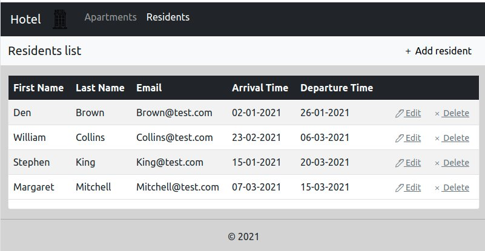
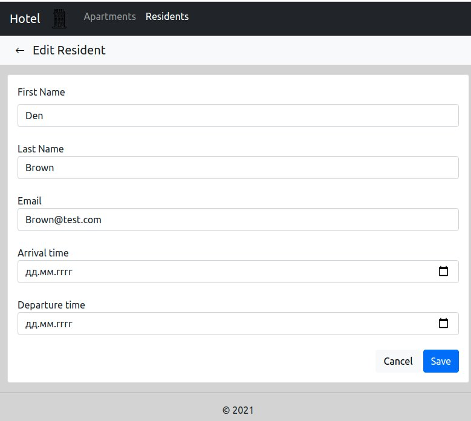
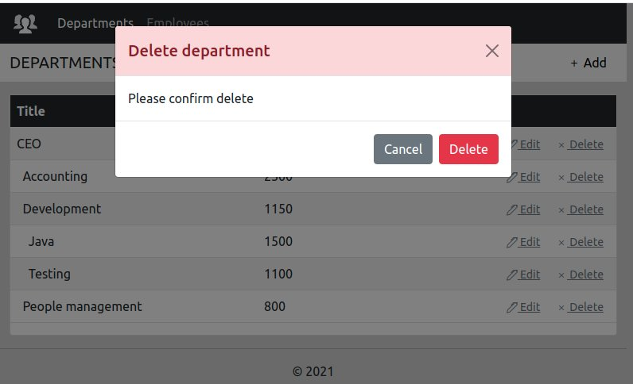

Функциональная спецификация программы «номера и постояльцы».

# Номера и постояльцы
## 1. Видение
Требуется создать рабочий прототип Web приложения для работы с пользователями.
Приложение должно реализовывать следующие функции:

- Просмотр списка апартаментов и редактирование этого списка.
- Просмотр списка постояльцев и редактирование этого списка.

## 2.1 Просмотр списка постояльцев
Данный режим программы предназначен для просмотра списка постояльцев.
Основной сценарий:

- Пользователь выбирает меню «Residents».
- Отображается форма просмотра списка всех постояльцев.

Рис. 2.1 Просмотр списка постояльцев

В списке отображаются следующие колонки:

- First Name — имя постояльца.
- Last Name — фамилия постояльца.
- Email — email постояльца.
- Arrival Time — дата прибытия постояльца.
- Departure Time — дата отъезда.

## 2.2. Добавление постояльца
#### 	Основной сценарий:
- Пользователь находясь в режиме просмотра списка постояльцев нажимает кнопку «Add resident»;
- Отображается страница для добавления нового постояльца;
- Пользователь вводит данные и нажимает кнопку “Save”;
- Если данные введены не корректно, то отображается предупреждение о вводе некорректных данных;
- Если данные корректны, то постоялец добавляется в базу данных;
- Если произошла ошибка сохранения данных, то выводится сообщение об ошибке: “Ошибка сохранения данных”;
- Если постоялец успешно добавлен, то открывается страница просмотра списка постояльцев с обновленными данными.

#### 	Сценарий отмены изменений:
- Пользователь находясь в режиме просмотра списка постояльцев нажимает кнопку «Add resident»;
- Отображается страница добавления;
- Пользователь вводит данные и нажимает кнопку «Cancel»;
- Данные не сохраняются в базу данных и открывается страница просмотра списка постояльцев с прежними данными.

При добавлении постояльца вводятся следующие реквизиты:

- First Name — имя постояльца.
- Last Name — фамилия постояльца.
- Email — email постояльца.
- Arrival Time — дата прибытия постояльца.
- Departure Time — дата отъезда.

Рис. 2.2 Добавление постояльца

## 2.3. Редактирование постояльца
#### 	Основной сценарий:
- Пользователь находясь в режиме просмотра списка постояльцев нажимает кнопку «Edit»;
- Отображается страница для редактирования;
- Пользователь вводит данные и нажимает кнопку “Save”;
- Если данные введены не корректно, то отображается предупреждение о вводе некорректных данных;
- Если данные корректны, то постоялец обновляется в базе данных;
- Если произошла ошибка сохранения данных, то выводится сообщение об ошибке: “Ошибка сохранения данных”;
- Если постоялец успешно добавлен, то открывается страница просмотра списка постояльцев с обновленными данными.

#### 	Сценарий отмены изменений:
- Пользователь находясь в режиме просмотра списка постояльцев нажимает кнопку «Edit»;
- Отображается страница для редактирования;
- Пользователь вводит данные и нажимает кнопку «Cancel»;
- Данные не сохраняются в базу данных и открывается страница просмотра списка постояльцев с прежними данными.

При редактировании постояльца вводятся следующие реквизиты:

- First Name — имя постояльца.
- Last Name — фамилия постояльца.
- Email — email постояльца.
- Arrival Time — дата прибытия постояльца.
- Departure Time — дата отъезда.

Рис. 2.3 Редактирование постояльца

#### 	Ограничения валидации данных:
- First Name — обязательное поле, длина не более 30 символов.
- Last Name — обязательное поле, длина не более 30 символов.
- Email — обязательное поле, длина не более 30 символов.
- Arrival Time — обязательное поле. Формат даты в виде «дд.мм.гггг».
- Departure Time — обязательное поле. Формат даты в виде «дд.мм.гггг».

## 2.4. Удаление постояльца
#### 	Основной сценарий:
- Пользователь находясь в режиме просмотра списка постояльцев нажимает кнопку «Delete» в строке выбранного постояльца;
- Отображается диалог подтверждения на удаление: «Delete resident. Please confirm delete»;
- Пользователь нажимает кнопку «Delete»;
- Происходит удаление постояльца в базе данных;
- Если произошла ошибка удаления данных, то выводится сообщение об ошибке: “Ошибка удаления данных”;
- Если постоялец успешно удален, то открывается страница просмотра списка постояльцев с обновленными данными.

#### 	Cценарий отмены удаления:
- Пользователь находясь в режиме просмотра списка постояльцев нажимает кнопку «Delete» в строке выбранного постояльца;
- Отображается диалог подтверждения на удаление: «Delete resident. Please confirm delete»;
- Пользователь нажимает кнопку «Cancel»;
- Открывается форма просмотра списка постояльцев с прежними данными.

Рис. 2.4 Удаление постояльца
